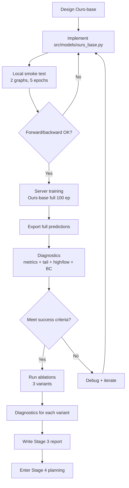

# Stage 3 Experiment Plan — Ours-base

> **Purpose:** Define experiments, success criteria, ablation strategy, and Stage 3/4/5 boundaries.
> **Date:** 2026-06-23
> **Status:** Plan only — execution begins after design approval and smoke test.

---

## 1. Experiment Overview

### 1.1 Ours-base Definition

**Model:** Edge-Attribute-Aware Heterogeneous GNN (EA-HGNN)
**Working name:** `Ours-base` in experiment documents
**Novelty:** Edge_attr-aware structural_link message + physics-gated typed message + shared dual decoder

### 1.2 Comparison Matrix (Planned Main Table Row)

| Method | Graph Type | Typed Message | Edge Attr Aware | Multi-scale | Physics Loss | Disp R² | Force R² | RelMAE |
|--------|:----------:|:-------------:|:--------------:|:-----------:|:------------:|:------:|:--------:|:------:|
| MLP | none | no | no | no | no | 0.8554 | 0.9824 | 0.0884 |
| GCN | homogeneous | no | no | no | no | 0.8476 | 0.9696 | 0.1227 |
| GAT | homogeneous | no | no | no | no | 0.8421 | 0.9632 | 0.1361 |
| RGCN | heterogeneous | relation-specific | no | no | no | 0.9366 | 0.9878 | 0.0724 |
| HGT | heterogeneous | typed attention | no | no | no | 0.9769 | 0.9891 | 0.0683 |
| **Ours-base** | **heterogeneous** | **physics-typed** | **yes** | **no** | **no** | **TBD** | **TBD** | **TBD** |

### 1.3 Ablation Suite

| Variant | Edge Attr | Physics Gate | Shared Latent | Purpose |
|---------|:---------:|:------------:|:-------------:|---------|
| Ours-base | ✅ | ✅ | ✅ | Full proposed model |
| Ours-base w/o edge_attr | ❌ | ✅ | ✅ | Isolate edge_attr contribution |
| Ours-base w/o gate | ✅ | ❌ | ✅ | Isolate physics gate contribution |
| Ours-base w/o shared | ✅ | ✅ | ❌ | Isolate shared decoder contribution |

### 1.4 Staged Comparison Strategy

| Stage | Comparison | Question Answered |
|:-----:|------------|-------------------|
| Smoke | Ours-base vs HGT, 2 graphs | Does forward/backward work? |
| Train | Ours-base full (100 ep) | What are primary metrics? |
| Ablate | 3 ablation variants | Which module contributes what? |
| Analyze | Full predictions → diagnostics | Where does Ours-base improve over HGT? |

---

## 2. Success Criteria

### 2.1 Primary (Must-Have)

| Metric | Target | Rationale |
|--------|:------:|-----------|
| **Disp R²** | ≥ 0.976 (within 0.001 of HGT) | Maintain overall displacement accuracy |
| **Dy R²** | ≥ 0.920 (+0.013 vs HGT 0.9077) | Primary innovation target |
| **Combined RelMAE** | < 0.0683 (HGT) | Concretely better overall |
| **HighResponse Disp R²** | ≥ 0.280 (vs HGT 0.208, approach MLP 0.336) | Fix HGT's high-response weakness |
| **Support BC residual (translation)** | ≤ 0.00018 (vs HGT 0.000206, target RGCN 0.000158) | Physical consistency |

### 2.2 Secondary (Should-Have)

| Metric | Target | Rationale |
|--------|:------:|-----------|
| Force R² | ≥ 0.988 (within 0.001 of HGT 0.9891) | Maintain force accuracy |
| Dy AbsErr P95 | < HGT Dy AbsErr P95 | Concrete tail improvement |
| Parameter count | ≤ 600K (vs HGT 744K) | More efficient |
| Training time | ≤ 4h (vs HGT 5.9h) | Practical efficiency |

### 2.3 Exploratory (Non-Blocking)

| Metric | Target | Rationale |
|--------|:------:|-----------|
| Dx R² | ≥ 0.990 | Follow-up if Dy improves |
| Rz R² | ≥ 0.988 | Structural_link may help rotation |
| Per-DOF BC residual | Translation ≤ rotation | Physical plausibility |

### 2.4 Not Required for Success

- ❌ Not required to beat HGT on all 6 disp components
- ❌ Not required to beat HGT on all 12 force components
- ❌ Not required to achieve Dy R² > 0.95 (this may need Stage 4 macro)
- ❌ Not required to achieve Force R² > 0.990 (near data-limited ceiling)

### 2.5 Minimum Viable Improvement

Ours-base is considered a success if it achieves **3 or more** of the primary targets without degrading any primary metric by more than 1% relative.

---

## 3. Diagnostics Checklist (After Training)

After Ours-base training completes and full predictions are exported:

Must-check:

1. [ ] Overall Disp R², Force R², RelMAE
2. [ ] Per-component R² (all 6 disp + 12 force)
3. [ ] Dy AbsErr P50/P90/P95 and RelErr P50/P90
4. [ ] HighResponse Disp MAE, R² (both current and translational-magnitude definitions)
5. [ ] Dy-only high-response MAE, R²
6. [ ] Support BC residual (translation, rotation separated)
7. [ ] Training curve (loss, val R², no NaN/Inf)
8. [ ] Wall-clock time vs HGT

Should-check:

9. [ ] Region-wise metrics (support, midspan, connection) — requires region labels
10. [ ] P95/P99 AbsErr per component
11. [ ] Prediction scatter plots (pred vs true for Dy, Dz, Fx)

---

## 4. Stage Boundaries

### 4.1 What Stage 3 Includes

```
┌─────────────────────────────────────────────┐
│ Stage 3: Ours-base                          │
│                                             │
│  src/models/ours_base.py                    │
│  configs/models.yaml (Ours-base section)     │
│  Full training + evaluation                 │
│  Full prediction export + diagnostics       │
│  Ablation experiments (edge_attr, gate, dec) │
│  Comparison vs HGT / RGCN / MLP             │
└─────────────────────────────────────────────┘
```

### 4.2 What Stage 4 Adds

```
┌─────────────────────────────────────────────┐
│ Stage 4: Macro anchor + multi-scale fusion  │
│                                             │
│  src/models/macro_anchor.py                 │
│  src/models/cross_scale_fusion.py           │
│  Anchor construction (geometric/stiffness)   │
│  Macro message passing                      │
│  Cross-scale fusion (residual/gated unpool)  │
│  Comparison: Ours-base vs Ours+macro        │
│  High-response + region-wise focus          │
└─────────────────────────────────────────────┘
```

### 4.3 What Stage 5 Adds

```
┌─────────────────────────────────────────────┐
│ Stage 5: Physics regularization             │
│                                             │
│  src/losses/physics_loss.py                 │
│  Support BC boundary loss                   │
│  Approximate equilibrium loss (optional)    │
│  Comparison: w/ physics vs w/o physics      │
│  Physical consistency metrics               │
└─────────────────────────────────────────────┘
```

### 4.4 What Stage 6 Adds

```
┌─────────────────────────────────────────────┐
│ Stage 6: Uncertainty quantification         │
│                                             │
│  src/uncertainty/conformal.py               │
│  Split conformal prediction                 │
│  Topology-smoothed conformal                │
│  Coverage / interval width metrics          │
└─────────────────────────────────────────────┘
```

### 4.5 Boundary Enforcement Rules

1. **No macro anchor in Stage 3** — even if it would obviously help Dy. Macro confounds micro message innovation.
2. **No physics loss in Stage 3** — physics loss can mask architectural weaknesses. Show architecture works first.
3. **No UQ in Stage 3** — separate methodological contribution.
4. **If edge_attr-aware message alone is not enough**, the correct response is to improve the edge encoding, NOT to add macro or physics loss.
5. **If Dy R² remains below 0.92 after Stage 3**, note it as the target for Stage 4 macro module.

---

## 5. MeshGraphNet-style Baseline Decision

### 5.1 Current Recommendation: Optional

| Factor | Assessment |
|--------|-----------|
| Does MeshGraphNet fill a gap not covered by HGT/RGCN? | Partially — encoder-processor-decoder is a distinct paradigm |
| Is it critical for the research thesis? | **No.** The thesis is about typed message + physics knowledge for heterogeneous graphs |
| Would it change the Ours-base design? | **No.** Ours-base design is independent of MeshGraphNet |
| Would it require significant effort? | Moderate — adapt from MeshGraphNets paper, no dynamic graph |
| Would it strengthen the baseline suite? | Yes, as a "processor-style" comparison point |

### 5.2 When to Add

- **If paper length allows** and the "types of message passing" narrative benefits from a 6th baseline
- **If a reviewer is expected to ask "what about MeshGraphNets?"** — then add it preemptively
- **If Ours-base underperforms** and we need to verify that the architecture itself is reasonable

### 5.3 Decision

**Do not implement MeshGraphNet-style before Ours-base.**
Priority: Ours-base design → Ours-base implementation → Ours-base diagnostics → (optional) MeshGraphNet.

---

## 6. Potential Risks and Mitigations

| Risk | Likelihood | Impact | Mitigation |
|------|:----------:|:------:|-----------|
| Edge_attr adds minimal benefit | Medium | High | Ablate early. If not helpful, focus on physics gate only |
| Physics gate saturates (always ≈1) | Medium | Medium | Use additive bias as fallback, gate as secondary option |
| HighResponse Disp R² still low | Medium | Medium | Note as Stage 4 target; macro may be necessary for large-displacement regions |
| Training time exceeds HGT | Medium | Low | Efficiency is secondary; document trade-off |
| Dy R² does not reach 0.920 | Medium | High | First verify edge_attr encoding; if still stuck, Dy may need Stage 4 macro |
| Support BC residual not improving | Low | Low | May need explicit physics loss (Stage 5) for this |

---

## 7. Experiment Execution Flow



**Note:** Ablations (step I) should be run in parallel on the server if GPU resources allow, not sequentially.

---

## 8. Resource Estimate

| Item | Estimate | Notes |
|------|:--------:|-------|
| Model implementation | 1 session | Single model file |
| Config updates | 0.5 session | Config file changes |
| Local smoke test | < 15 min | 2 graphs, CPU |
| Server full training | ~2-4h | Per seed (3 seeds planned) |
| Ablation runs | ~2-3h each | 3 ablations, can be parallel |
| Total server time | ~12-16h | Including 3 seeds + 3 ablations |

---

## 9. Data Management

| Artifact | Path | Size |
|----------|------|:----:|
| Model checkpoint | `outputs/baselines/Ours-base/<timestamp>/best_model.pt` | ~5-10 MB |
| Metrics summary | `outputs/baselines/Ours-base/<timestamp>/metrics_summary.json` | ~10 KB |
| Full predictions | `outputs/predictions/stage3/ours_base/<timestamp>/` | ~300 MB |
| Ablation checkpoints | `outputs/baselines/Ours-base-abl-*/<timestamp>/` | ~5-10 MB each |

**Git:** Model outputs are gitignored. Predictions are gitignored. Only config files and code are tracked.
